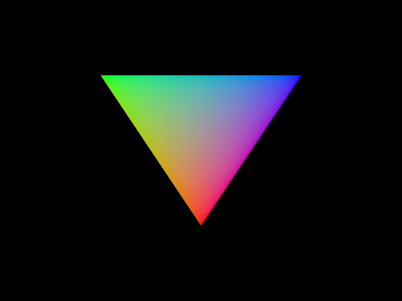

<h1 align="center">Hi 👋, We're Anvie Labs</h1>  
<h3 align="center">We work towards building and providing security products.</h3>  
  

  
  
  
- 🔭 We're currently working on **Urumi (our own GUI library)**  
- 🔭 and **Anvie (It's a present)**
  
  
  
<h3 align="center">
    Languages and Tools:
</h3>  

     
    
    
     
    

